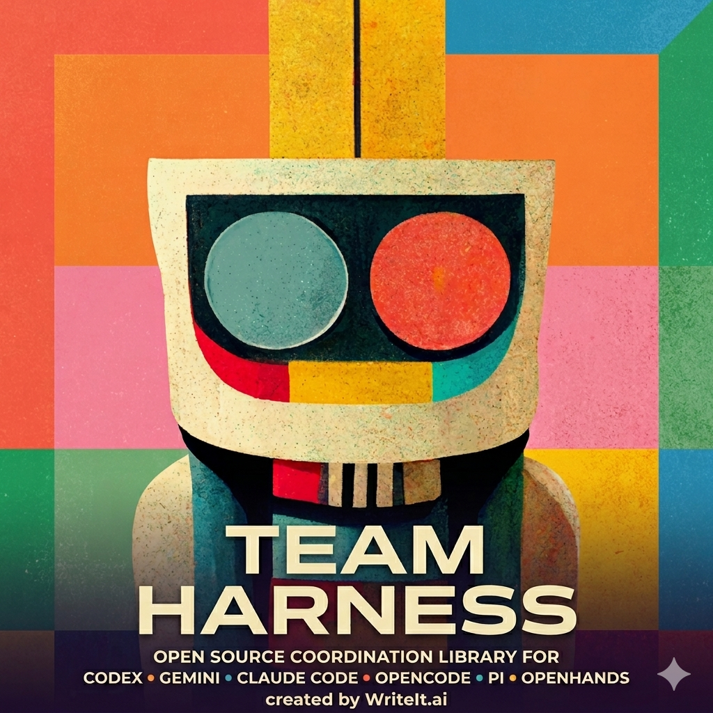

# Team Harness

Coordination layer for other harnesses (Codex, Gemini, Claude Code, Grok Build, Antigravity, OpenCode, pi, OpenHands).

<br>

<p align="center">
  
</p>

## What does it do?

You can run prompts like this one:

```
Tell me what are the main pieces that are still missing for achieving the MVP.

You will make an agentic team to achieve it.

Create an agent team to do it. They should be responsible for:
- coming up with the analysis using CODEX, CLAUDE and GEMINI
    - perform the analysis as best as you can and output your findings into a new file inside the dedicated directory
- creating the final report
    - read all the analyses from the previous agents, and write down the final version of the findings and opinions into a SUMMARY.md
```

Team Harness will coordinate the work between Codex, Claude Code and Gemini CLI.

You could achieve a similar result if you used Claude Code's agent teams functionality.
However, Team Harness gives you the ability to plug in any model + you can tweak the underlying system prompts much more easily.

## Installation

```bash
pip install team-harness
# or
uv tool install team-harness
```

To upgrade to the latest version:

```bash
pip install --upgrade team-harness
# or
uv tool install --upgrade team-harness
```

## Prerequisites

Worker CLIs must be installed and authenticated separately. You do not need all of them; restrict a run with `--agents codex,gemini` to use only the ones you have.
Install with `pip install openhands` (the PyPI distribution name is `openhands`, provided by the OpenHands-CLI repo).

| Worker    | Install docs                                                |
|-----------|-------------------------------------------------------------|
| `codex`   | [Codex CLI](https://github.com/openai/codex)               |
| `gemini`  | [Gemini CLI](https://github.com/google-gemini/gemini-cli)  |
| `claude`  | [Claude Code](https://docs.anthropic.com/en/docs/claude-code) |
| `grok`    | [Grok Build CLI](https://docs.x.ai/build/cli/headless-scripting) (`XAI_API_KEY` or `grok login`) |
| `antigravity` | [Antigravity CLI](https://antigravity.google/docs/cli-overview) |
| `openhands` | [OpenHands CLI](https://github.com/OpenHands/OpenHands-CLI) |
| `opencode`| [opencode](https://github.com/opencode-ai/opencode)        |
| `pi`      | [pi](https://github.com/badlogic/pi-mono)                  |

## Quick start

```bash
# run from your project root
cd <your project>

# Create a project-local config in ./.team-harness/
# Creates config.toml, coordinator_system_message.md, worker_suffix.md, and worker_footer.md
th init
```

### If you are authenticated to codex
```bash
TEAM_HARNESS_PROVIDER=codex th repl
```

or

in `<your project>/.team-harness/config.toml` set `provider = "codex"`

### Alternatively with API keys
```bash
OPENROUTER_API_KEY="sk-or-..." th repl
```

or 

```bash
OPENAI_API_KEY="sk-or-..." TEAM_HARNESS_API_BASE="https://openai.com/api/v1" th repl
```

### Headless

```bash
# Single-shot run
th run "Write unit tests for src/utils.py using pytest"

# From a file
th run -f task.txt
```

### Viewing Logs

```bash
# View run logs
th logs
th logs <run-id>
```

## Python SDK

Use team-harness programmatically from Python:

```python
import asyncio
from pathlib import Path
from team_harness import CallerContext, TeamHarness, TeamHarnessResult

async def main():
    harness = TeamHarness(
        api_key="sk-or-...",
        model="anthropic/claude-sonnet-4",
        agents=["codex", "gemini"],
        # Optional embedding contract: keeps the complete run beneath a
        # caller-owned root and supplies outer-session identity to agents.
        caller_context=CallerContext(
            trace_root=Path("/abs/session/traces/attempt-42"),
            parent_assignment_path=Path("/abs/session/attempt-42/assignment.json"),
            parent_attempt_id="attempt-42",
            root_session_id="session-root",
            session_id="session-leaf",
            session_depth=1,
            workflow_role="inner",
        ),
    )
    result: TeamHarnessResult = await harness.run(
        "Write unit tests for src/utils.py using pytest"
    )
    print(result.text)
    for agent in result.agents:
        print(f"  {agent.id} ({agent.agent_type}): {agent.status}")

asyncio.run(main())
```

All CLI options are available as constructor parameters:

```python
harness = TeamHarness(
    provider="codex",           # or "openai_compat" (default)
    model="codex-mini-latest",
    api_base="https://openrouter.ai/api/v1",
    api_key="sk-or-...",
    codex_auth_path="~/.codex/auth.json",
    agents=["codex", "gemini"], # or "codex,gemini"
    max_retries=5,
    retry_base_delay_s=1.0,
    retry_max_delay_s=30.0,
    max_depth=3,
    rate_limit_circuit_breaker=True,
    rate_limit_default_cooldown_s=900,
    system_prompt="Extra instructions",
    system_prompt_file="prompt.txt",
    agent_models={"codex": "gpt-5.5"},
    agent_reasoning_efforts={"codex": "high"},
    output_dir="./_outputs",
    cwd="./project",
    console_mode="silent",      # "silent" | "auto" | "plain" | "rich"
)
```

`agent_models` and `agent_reasoning_efforts` override the resolved worker
template defaults for the named agent types. They do not change the
coordinator model used by `model=...`, and a per-spawn `model` argument still
wins for that one worker.

`output_dir` overrides `[coordinator].output_dir` for SDK runs. Each run still
creates a child directory named by the team-harness run id.

The `run()` method returns a `TeamHarnessResult` with:

- `text` -- final assistant response
- `agents` -- list of `AgentSummary` (id, agent_type, status, exit_code, cwd)
- `run_id` -- unique run identifier
- `run_json_path` -- explicit canonical coordinator run record
- `session_output_dir` -- worker/session artifact directory
- `coordinator_input_path` -- generated system/user input captured before the
  first provider operation

Errors raise `TeamHarnessError`. Structured failures expose the same three paths
in `error.detail`. Embedding callers can inspect `get_capabilities()` for the
named caller contract before selecting it. Run logs are always finalized, even
on failure. For caller-context runs, generated coordinator input, direct-agent
assignments, and worker stdout/stderr stay under the returned run directory.

Capability names, rather than the package version, are the compatibility
boundary. Caller-contract v1 advertises `caller_run_record_v1`,
`coordinator_input_v1`, `spawn_assignment_v1`, and
`nested_caller_context_v1`:

```python
from team_harness import get_capabilities

required = {
    "caller_run_record_v1",
    "coordinator_input_v1",
    "spawn_assignment_v1",
    "nested_caller_context_v1",
}
capabilities = get_capabilities()
if not capabilities.supports(*required):
    raise RuntimeError("installed team-harness lacks the required caller contract")
```

`nested_caller_context_v1` applies specifically when a coordinator dynamically
chooses the built-in `type="harness"`. That child coordinator retains the same
outer loop session, depth, attempt, role, and absolute relevant-state paths; it
receives its own direct assignment and harness artifact subtree and records the
parent harness run id. It is delegation inside the current loop assignment,
not a newly created loop layer.

## Configuration

th works out of the box with built-in defaults. To create a config file explicitly:

```bash
# Create project-local config for the current repo
th init

# Create global config under ~/.team-harness/config.toml
th init --global

# Overwrite an existing config file
th init --force
th init --global --force
```

Global config is intended for user-wide defaults. Project config is intended for repo-specific settings and should not contain secrets; keep API keys in environment variables.

Example global config:

```toml
[coordinator]
provider = "openai_compat"
model = "gpt-5.5"
api_base = "https://openrouter.ai/api/v1"
coordinator_system_message_file = "coordinator_system_message.md"
worker_suffix_file = "worker_suffix.md"
worker_footer_file = "worker_footer.md"
system_prompt = ""
output_dir = "_outputs"

# Worker agents are described as structured commands: a base `command`
# list, `shared_flags` that are always applied, and `resume_flags` that
# are applied only when resuming a previous session. A `session_capture`
# sub-table describes how the harness extracts the provider's session id
# from the worker's stream-json output so the run can be resumed later.
#
# Any field you omit is inherited from the built-in default for that
# agent type, so it is fine to override only the piece you care about.
# Run `th init --force` to regenerate a complete, commented sample.

[agents.codex]
command = ["codex", "exec"]
shared_flags = [
    "--dangerously-bypass-approvals-and-sandbox",
    "--skip-git-repo-check",
    "--json",
]
resume_prefix = ["resume"]
resume_flags = ["{session_id}"]
model_flag = "--model"
default_model = "gpt-5.5"
deduplicate_flags = [
    "--dangerously-bypass-approvals-and-sandbox",
    "--skip-git-repo-check",
    "--json",
]
reasoning_effort_flag = ["-c", "model_reasoning_effort={effort}"]
# reasoning_effort = "high"   # uncomment to pin a level

[agents.codex.session_capture]
strategy = "stream_json_event"
match = { type = "thread.started" }
field_path = ["thread_id"]

[agents.gemini]
command = ["gemini"]
shared_flags = ["--approval-mode", "yolo", "--output-format", "stream-json"]
resume_flags = ["--resume", "{session_id}"]
prompt_flag = "-p"
model_flag = "--model"

[agents.gemini.session_capture]
strategy = "stream_json_event"
match = { type = "init" }
field_path = ["session_id"]

[agents.claude]
command = ["claude"]
shared_flags = [
    "-p",
    "--dangerously-skip-permissions",
    "--output-format", "stream-json",
    "--verbose",
]
resume_flags = ["--resume", "{session_id}"]
model_flag = "--model"
model_env_vars = [
    "ANTHROPIC_MODEL",
    "ANTHROPIC_DEFAULT_SONNET_MODEL",
    "ANTHROPIC_DEFAULT_OPUS_MODEL",
]
deduplicate_flags = [
    "-p",
    "--dangerously-skip-permissions",
    "--verbose",
]
reasoning_effort_flag = ["--effort", "{effort}"]
# default_model = "claude-sonnet-4-6"   # uncomment to pin a default
# reasoning_effort = "high"               # values: low|medium|high|max

# Uncomment the provider_env block to route claude through OpenRouter.
# See "Connecting workers to OpenRouter" below for the full recipe.
# [agents.claude.provider_env]
# ANTHROPIC_BASE_URL = "https://openrouter.ai/api"
# ANTHROPIC_AUTH_TOKEN = "{env:OPENROUTER_API_KEY}"
# ANTHROPIC_API_KEY = ""

[agents.claude.session_capture]
strategy = "stream_json_event"
match = { type = "system", subtype = "init" }
field_path = ["session_id"]

[agents.grok]
command = ["grok"]
shared_flags = [
    "--always-approve",
    "--output-format", "streaming-json",
    "--no-auto-update",
]
resume_flags = ["--resume", "{session_id}"]
prompt_flag = "-p"
model_flag = "--model"
default_model = "grok-4.5"
deduplicate_flags = ["--always-approve", "--no-auto-update"]
reasoning_effort_flag = ["--reasoning-effort", "{effort}"]

[agents.grok.session_capture]
strategy = "stream_json_event"
match = { type = "end" }
field_path = ["sessionId"]

[agents.antigravity]
command = ["agy"]
shared_flags = [
    "--dangerously-skip-permissions",
    "--print",
    "--print-timeout", "60m",
]
resume_flags = ["--conversation", "{session_id}"]
model_flag = false
deduplicate_flags = [
    "--dangerously-skip-permissions",
    "--print",
]

[agents.openhands]
command = ["openhands"]
shared_flags = ["--headless", "--json", "--override-with-envs"]
prompt_flag = "-t"
model_env_vars = ["LLM_MODEL"]

[agents.opencode]
command = ["opencode"]

[agents.pi]
command = ["pi", "--print", "--no-session"]

[agents.harness]
command = ["th", "run"]
model_flag = "--model"
```

OpenHands runs are not auto-resumable from team-harness today. The `--json` output format is not parseable as stream-json.

`--override-with-envs` is required so `LLM_MODEL` injection works. A side-effect is that any `LLM_MODEL`, `LLM_API_KEY`, or `LLM_BASE_URL` already set in your shell will also be picked up by the worker. Unset or override them if you want deterministic per-run behavior.

Grok Build (`grok`) runs headless with `--always-approve`, `--output-format streaming-json`, and `--no-auto-update`. Session ids are captured from the final NDJSON `end` event (`sessionId`) and resume uses `--resume <id>`. Auth is external: set `XAI_API_KEY` or run `grok login`. Set `GROK_HOME` when CI needs an isolated Grok home; `GROK_DISABLE_AUTOUPDATER=1` is an optional environment-policy fallback to `--no-auto-update` and is not injected by the built-in template. Do not put `--session-id` in `shared_flags` — combining it with `--resume` forks rather than resumes. A crash before the `end` event may leave no captured session id. Unattended tool approval is intentional for harness workers.

Antigravity runs use `agy --print` so the worker can run as a non-interactive subprocess. Automatic session capture is not configured because print mode does not emit stream-json; callers that already know a conversation id can still use resume mode, which renders `--conversation <id>`.

Custom `[agents.openhands]` or `[agents.grok]` sections in existing `.team-harness/config.toml` files will, after upgrade, inherit the new built-in defaults for any fields they do not explicitly set (including `shared_flags`). If your custom section was a standalone agent that coincidentally used the name `openhands` or `grok`, rename it or explicitly clear inherited fields (e.g. `shared_flags = []`, `prompt_flag = false`, `model_env_vars = []`).

### Prompt configuration

`th init` creates four files in the target `.team-harness/` directory:

| File                | Purpose                                                                     |
|---------------------|-----------------------------------------------------------------------------|
| `config.toml`            | All coordinator and agent settings                                          |
| `coordinator_system_message.md`  | Editable coordinator base prompt (seeded from the built-in default)         |
| `worker_suffix.md`       | Text automatically appended to every spawned worker prompt (empty by default)|
| `worker_footer.md`       | Default worker output requirements template, editable per project           |

Prompt-related config keys:

| Key                       | Purpose                                                                    |
|---------------------------|----------------------------------------------------------------------------|
| `coordinator_system_message_file` | Path to the coordinator base prompt file                                   |
| `worker_suffix_file`      | Path to text appended to every spawned worker prompt                       |
| `worker_footer_file`      | Path to the worker footer template appended after the suffix               |
| `system_prompt`           | Inline extension text appended after the coordinator base prompt           |

**`coordinator_system_message_file`** — Points to the coordinator base prompt file. If the file is missing, a warning is emitted and the built-in default is used. If no key is configured, the built-in default is used silently.

**`worker_suffix_file`** — Points to a file whose contents are appended to every spawned worker prompt. The coordinator is told that this suffix exists so it does not duplicate those instructions. If the file is missing or empty, no suffix is appended.

**`worker_footer_file`** — Points to a file whose contents define the footer appended to every spawned worker prompt. The footer should usually keep the `{session_output_dir}` placeholder so workers are told where to write artifacts. If the file is missing or empty, the built-in footer is used.

**`system_prompt`** — Inline text appended as an extension after the base prompt. This is separate from `coordinator_system_message_file` and is additive.

**CLI `--system-prompt-file`** — Reads extra text from a file and appends it as a runtime extension. This is an extension source (like `system_prompt`), not a base prompt replacement. CLI paths resolve relative to the current working directory.

Prompt file paths in `config.toml` resolve relative to the directory containing the config file that defined them. Absolute paths are used as-is.

Prompt files are read with UTF-8 encoding and are limited to 100 KB. Files that exceed this limit, are not valid UTF-8, or are unreadable produce a clear error message.

Experimental Codex config:

```toml
[coordinator]
provider = "codex"
model = "codex-mini-latest"
# optional override for custom proxies or tests
# api_base = "https://chatgpt.com/backend-api"
# optional explicit auth location
# codex_auth_path = "~/.codex/auth.json"
```

### Project-level configuration

`th init` writes `./.team-harness/config.toml`, `coordinator_system_message.md`, `worker_suffix.md`, and `worker_footer.md`. Local config discovery walks upward from the effective `--cwd` and the nearest ancestor config overrides the global file.

Lists replace rather than extend. For example, setting `[coordinator].allowed_agents` in a local config replaces the global list instead of appending to it.

`[coordinator].output_dir` controls where per-run coordinator and worker
artifacts are written. Each run creates `<output_dir>/<run_id>/`, and the
coordinator may instruct workers to place notes, reports, logs, or other
deliverables there. The harness also writes a compact
`worker_sessions.json` manifest in that directory summarizing every spawned
worker for the run. Relative `output_dir` values resolve against the effective
`--cwd`.

Coordinator retry behavior is controlled by three `[coordinator]` keys:

```toml
max_retries = 5
retry_base_delay_s = 1.0
retry_max_delay_s = 30.0
```

Retry records for transient coordinator API/network failures are written to
`run.json` under `coordinator_retries`, and the terminal run-level failure is
written under `failure`.

Hard rate limits reported by worker JSONL streams use a run-scoped family
circuit by default:

```toml
rate_limit_circuit_breaker = true
rate_limit_default_cooldown_s = 900
```

When a worker reports a terminal 429 or rejected rate-limit event, later spawns
for the same agent-template family short-circuit until the provider's reset time
(or the fallback cooldown when no reset is present). `agent_availability` shows
the coordinator which families remain usable, and `run.json` records the trip
under `rate_limited_families`. Set the boolean to `false` to retain the previous
spawn behavior.

`th init --force` overwrites `config.toml` but preserves existing `coordinator_system_message.md`, `worker_suffix.md`, and `worker_footer.md` files to protect user customizations. Missing sidecar files are re-created.

Project-level `.team-harness/config.toml`, `.team-harness/coordinator_system_message.md`, `.team-harness/worker_suffix.md`, and `.team-harness/worker_footer.md` should normally be committed to version control so prompt behavior is reproducible across contributors and CI.

### Configuration resolution order

1. CLI flags
2. Environment variables
3. Local `.team-harness/config.toml`
4. Global `~/.team-harness/config.toml`
5. Built-in defaults

Relevant environment variables:

- `TEAM_HARNESS_PROVIDER`
- `TEAM_HARNESS_MODEL`
- `TEAM_HARNESS_API_BASE`
- `TEAM_HARNESS_CODEX_AUTH_PATH`
- `OPENROUTER_API_KEY` or `OPENAI_API_KEY`

### Adding custom agent types

Add a new `[agents.<name>]` section with a structured command. The only
required field is `command`; everything else has sensible defaults.

```toml
[agents.myagent]
command = ["my-custom-cli"]
shared_flags = ["--mode", "auto"]
model_flag = "--model"   # set to `false` if the CLI has no model flag
```

Some CLIs use env-based model injection instead of a `--model` flag. OpenHands is the built-in example:

```toml
[agents.openhands]
command = ["openhands"]
shared_flags = ["--headless", "--json", "--override-with-envs"]
model_flag = false
model_env_vars = ["LLM_MODEL"]
```

The new type appears automatically in the coordinator's `spawn_agent` tool.
The task prompt is appended at the tail of the argv list by default; set
`prompt_position = "after_command"` if your CLI wants the prompt earlier,
or `prompt_flag = "-p"` if the prompt is introduced by a flag (like `gemini -p`).
Use `deduplicate_flags` only for standalone flags that are idempotent if a
coordinator repeats them through `spawn_agent(flags=[...])`; the built-in Codex
template uses this for its standalone shared flags such as
`--dangerously-bypass-approvals-and-sandbox`, and the built-in Claude template
uses it for `-p`, `--dangerously-skip-permissions`, and `--verbose`.
The built-in Antigravity template uses it for `--dangerously-skip-permissions`
and `--print`.

Placeholders that can appear inside `shared_flags`, `resume_prefix`, or
`resume_flags`:

- `{session_id}` — substituted with the resume session id (resume mode only).
- `{generated_uuid}` — substituted with a harness-generated UUID at spawn
  time. Useful for CLIs like `claude` that accept `--session-id <uuid>` up
  front so the harness can record the id deterministically.

Session ids can be captured from a worker's stream-json output via a
`[agents.<name>.session_capture]` sub-table with `strategy`, `match`, and
`field_path` (see the codex/gemini/claude examples above).

### Setting a default model

Two config keys control the model a worker runs with:

- **`default_model`** — the model used when the coordinator does not pass
  an explicit `model=...` in its `spawn_agent` tool call. Absent = no
  default; worker CLI uses its own internal default.
- **`model_flag`** — the CLI flag name used to inject the model into the
  argv, e.g. `"--model"`.

Precedence:

| Source | Priority |
|---|---|
| Explicit `spawn_agent(model="…")` from the coordinator | 1 (highest) |
| `[agents.<name>].default_model` | 2 |
| Worker CLI's own internal default | 3 (fallback) |

Note: `[coordinator].model` controls the **coordinator's own** model (the
one used to talk to OpenRouter / Codex). It does NOT flow through to
workers. Per-agent defaults come from `[agents.<name>].default_model`.

#### Codex example

```toml
[agents.codex]
command = ["codex", "exec"]
default_model = "gpt-5.5"    # every codex spawn gets --model gpt-5.5
```

Clear a default on a specific agent with `default_model = false` (or an
empty string). This is useful if the built-in default is wrong for your
setup.

#### Claude example — env-var model injection

Claude Code does not rely solely on `--model`. Several internal code
paths (`getBestModel`, the Max-subscriber branch of `getDefaultMainLoopModel`)
bypass `ANTHROPIC_MODEL` and read `ANTHROPIC_DEFAULT_OPUS_MODEL` or
`ANTHROPIC_DEFAULT_SONNET_MODEL` directly. Setting just `ANTHROPIC_MODEL`
is not enough for a deterministic override.

Templates can declare `model_env_vars` — a list of env var names that the
spawner will set to the effective model on every spawn:

```toml
[agents.claude]
command = ["claude"]
shared_flags = [
    "-p",
    "--dangerously-skip-permissions",
    "--output-format", "stream-json",
    "--verbose",
]
model_flag = "--model"
model_env_vars = [
    "ANTHROPIC_MODEL",
    "ANTHROPIC_DEFAULT_SONNET_MODEL",
    "ANTHROPIC_DEFAULT_OPUS_MODEL",
]
default_model = "claude-sonnet-4-6"   # optional; leave unset to let the
                                      # coordinator decide per spawn
```

The built-in `claude` default intentionally lists **only** those three
env vars and does **not** touch `ANTHROPIC_DEFAULT_HAIKU_MODEL`,
`ANTHROPIC_SMALL_FAST_MODEL`, or `CLAUDE_CODE_SUBAGENT_MODEL` — cheap
auxiliary helpers keep running on haiku. If your own shell environment
sets any of those, they pass through to the worker unchanged (the
harness only merges its own env vars on top of `os.environ`).

Merge order for child process env: `os.environ` < template `provider_env`
< template `model_env_vars` < caller's explicit `extra_env`. A test or
SDK caller can always override a template env var by passing
`extra_env={"ANTHROPIC_MODEL": "…"}`.

### Reasoning effort

Worker CLIs that expose a reasoning-effort knob are configured via two
fields:

- **`reasoning_effort`** — the value (e.g. `"high"`). Absent = no
  injection, worker CLI uses its own default.
- **`reasoning_effort_flag`** — the argv token shape, with a literal
  `{effort}` placeholder that the harness substitutes at render time.
  This ships with a sensible default per built-in agent so users
  normally only set `reasoning_effort`.

The coordinator can also override the level per spawn with
`spawn_agent(effort="…")`, mirroring `spawn_agent(model="…")`:

| Source | Priority |
|---|---|
| Explicit `spawn_agent(effort="…")` from the coordinator | 1 (highest) |
| `[agents.<name>].reasoning_effort` | 2 |
| Worker CLI's own internal default | 3 (fallback) |

`spawn_agent(effort=…)` fails loudly instead of lying: passing it for an
agent type whose template cannot carry the value (no
`reasoning_effort_flag` with an `{effort}` placeholder), passing a
blank level, or combining it with a raw `flags` entry that carries the
same reasoning-effort option all return an ERROR result rather than
silently dropping or double-rendering the override.

Each spawn's requested and effective model/effort are recorded on the
agent's entry in `run.json` (`requested_model` / `requested_effort` /
`effective_model` / `effective_effort`), so an outer reviewer can verify
which tier a task actually ran on. `effective_model` only claims what
was actually injected: it is `null` for templates with no model
injection surface, and for env-only templates it reflects a caller
`env` override of the model variable (or `null` when the override is
partial/conflicting).

Per-CLI shapes and allowed values:

| Worker | `reasoning_effort_flag` | Allowed values |
|---|---|---|
| codex  | `["-c", "model_reasoning_effort={effort}"]` | `low`, `medium`, `high`, `xhigh` |
| claude | `["--effort", "{effort}"]` | `low`, `medium`, `high`, `max` |
| grok   | `["--reasoning-effort", "{effort}"]` | `low`, `medium`, `high` |
| gemini | (not supported upstream) | — |

The harness does **not** validate the value against a per-CLI enum. Pass
what the worker CLI accepts; invalid levels are reported by the worker.

Example — pin codex to high effort:

```toml
[agents.codex]
reasoning_effort = "high"
```

Clear a default with `reasoning_effort = false` (same convention as
`default_model`).

### Connecting workers to OpenRouter

team-harness can route worker CLIs through OpenRouter so the same
OpenRouter account that fuels the coordinator also fuels each worker.
This relies on a third template field, `provider_env` — a list of env
vars the spawner sets on the child process. Values may contain
`{env:VARNAME}` placeholders that are resolved from the parent shell at
spawn time, so API keys stay in your shell and never touch `config.toml`.

Before either recipe: export your OpenRouter key in your shell once:

```bash
export OPENROUTER_API_KEY=sk-or-...
```

#### Codex via OpenRouter

Codex reads its provider config from a `-c` command-line override (or
the `~/.codex/config.toml` file). Add the `-c` tokens to the codex
template's `shared_flags`:

```toml
[agents.codex]
command = ["codex", "exec"]
shared_flags = [
    "--dangerously-bypass-approvals-and-sandbox",
    "--skip-git-repo-check",
    "--json",
    "-c", "model_provider=openrouter",
    "-c", 'model_providers.openrouter.name="openrouter"',
    "-c", 'model_providers.openrouter.base_url="https://openrouter.ai/api/v1"',
    "-c", 'model_providers.openrouter.env_key="OPENROUTER_API_KEY"',
]
default_model = "openai/gpt-5.3-codex"   # the OpenRouter-flavoured model name
```

No `provider_env` needed — codex reads `OPENROUTER_API_KEY` itself via
the `env_key` setting.

#### Claude Code via OpenRouter

Claude Code reads its provider config from env vars. Add a
`[agents.claude.provider_env]` sub-table:

```toml
[agents.claude]
default_model = "anthropic/claude-opus-4.6"   # OpenRouter-flavoured model name

[agents.claude.provider_env]
ANTHROPIC_BASE_URL = "https://openrouter.ai/api"
ANTHROPIC_AUTH_TOKEN = "{env:OPENROUTER_API_KEY}"
ANTHROPIC_API_KEY = ""   # must be empty — prevents Claude Code from falling back to native auth
```

The `{env:OPENROUTER_API_KEY}` placeholder is resolved from `os.environ`
at spawn time. If the variable is missing, the harness warns once and
substitutes an empty string (the child will then fail its own auth with
a clear message).

Note: the three `ANTHROPIC_DEFAULT_*_MODEL` env vars from the "Setting a
default model" section continue to work and layer on top of
`provider_env` — setting `default_model = "anthropic/claude-opus-4.6"`
above populates all three of them automatically.

#### Gemini via OpenRouter

Not supported by the upstream `gemini` CLI — it authenticates directly
against Google APIs with no OpenAI-compatible base-URL mode. The harness
does not ship a recipe.

### Migrating from legacy single-string templates

Earlier versions of team-harness accepted a `template = "codex exec ... {prompt}"`
single-string form. That form was deprecated in #16 and **removed** in the
follow-up refactor. Attempting to load a config that still contains a
`template = "..."` line now raises a clear error naming the offending file:

```
agents.codex.template is no longer supported (in /path/to/config.toml).
The single-string template form was removed in team-harness after #16.
Migrate to the structured form, e.g.:

    [agents.codex]
    command = ["codex", "exec"]
    shared_flags = ["--dangerously-bypass-approvals-and-sandbox", "--json"]

See README.md → 'Adding custom agent types' for the full schema ...
```

The fastest migration path is:

```bash
th init --force    # regenerates a complete structured sample
```

`th init --force` preserves your existing `coordinator_system_message.md`,
`worker_suffix.md`, and `worker_footer.md` sidecar files, so you can use it
to regenerate just `config.toml`.

### Authentication

- `provider = "openai_compat"` uses your OpenRouter or other OpenAI-compatible API key.
- `provider = "codex"` uses the auth file written by `codex login`.
- Codex auth resolution order is:
  1. `codex_auth_path` from CLI or config
  2. `TEAM_HARNESS_CODEX_AUTH_PATH`
  3. `$CODEX_HOME/auth.json`
  4. `~/.codex/auth.json`
- Codex auth path values that are relative resolve against the effective harness `--cwd`.
- Each worker CLI uses its own native auth and local config.
- The harness does not forward the coordinator API key to workers unless you explicitly pass environment overrides at spawn time.

### Codex Subscription

`provider = "codex"` is experimental. team-harness talks to the ChatGPT Codex Responses SSE endpoint through a shared `httpx` client and still uses the same `model` field in config and CLI overrides.

Known built-in Codex model names:

- `codex-mini-latest`
- `openai/codex-mini-latest`
- `gpt-5.1-codex-mini`
- `openai/gpt-5.1-codex-mini`
- `gpt-5.1-codex-max`
- `openai/gpt-5.1-codex-max`
- `gpt-5.5`

Unknown Codex models still work, but startup prints a warning because context tracking may be inaccurate.

## CLI flags

```
th run [OPTIONS] [TASK]

Options:
  -f, --file PATH            Read task from file instead of argument
  --provider TEXT             Coordinator provider: "openai_compat" or "codex"
  --model TEXT                Override coordinator model (e.g. "anthropic/claude-sonnet-4")
  --api-base TEXT             Override coordinator base URL
  --api-key TEXT              Override coordinator API key for openai_compat
  --codex-auth-path TEXT      Override Codex auth.json location
  --agents TEXT               Comma-separated allowlist (e.g. "codex,gemini")
  --max-retries INT           API retry budget for 429/5xx errors (default: 5)
  --max-depth INT             Nested harness depth limit (default: 3)
  --system-prompt TEXT        Extra text appended to the system prompt
  --system-prompt-file PATH   Read system prompt extension from file
  --cwd PATH                  Working directory for the run (default: ".")
```

`th repl` accepts the same options (except `-f`/`--file` and the `TASK` argument).

## REPL commands

| Command    | Description                                                     |
|------------|-----------------------------------------------------------------|
| `/clear`   | Clear conversation history and context tracking; start fresh    |
| `/reset`   | Alias for `/clear`                                              |
| `/compact [focus]` | Manually compact earlier conversation into a summary for the next turn |
| `/quit`    | Graceful shutdown: wait for running agents, then exit           |
| `/agents`  | Print current agent status table inline                         |
| `/log`     | Print the path to the current run log                           |

## Context management

- The status bar shows current context occupancy from the latest exact API usage, not cumulative spend.
- When local changes exist after the last exact usage update, the displayed total may be estimated and prefixed with `~`.
- Auto-compaction runs proactively before a new coordinator turn once the model-specific threshold is reached, using the same tracked total and falling back to a local estimate when provider usage is unavailable.
- Auto-compaction only runs when the last message role is `user`, so it never compacts in the middle of a tool exchange.
- Auto-compaction is always on in v1 and does not have a public config knob.
- OpenAI-compatible providers may expose provider-prefixed model ids such as `openai/gpt-5.5`; model-limit resolution accepts both bare and prefixed forms.
- Manual compaction runs between turns and rewrites earlier history into a compact summary for the next turn. `/compact [focus]` never runs in the middle of a tool exchange.
- `/compact <focus>` lets you bias what the summary emphasizes without changing the command transcript shape that the coordinator sees afterward.
- `/clear` is the manual escape hatch when you want to keep the same session, run log, and agent state but start with a fresh conversation.

## Terminal features

The rich console mode (default when stdout is a TTY) includes several visual enhancements:

- **Spinner animation** — an animated braille spinner appears in the status bar while the coordinator is thinking (before tokens start streaming).
- **iTerm2 tab progress** — when running in iTerm2, an indeterminate progress indicator appears in the terminal tab during processing. This is gated on iTerm2 detection and disabled inside tmux.
- **User prompt styling** — submitted user prompts are displayed with a dark background (`rgb(55,55,55)`) and white text to visually distinguish them from assistant output.
- **Agent emojis** — each agent type displays a per-type emoji (e.g., 🔷 codex, ♊ gemini, 🟣 claude) in the agent panel and event log.
- **Path coloring** — file paths in tool call arguments and results are highlighted in cyan.
- **Bold consistency** — agent types, turn numbers, and running status use bold styling for emphasis.

These features degrade gracefully: `PlainConsole` shows static indicators, and `SilentConsole` (SDK mode) produces no output.

## REPL editing keys

| Key              | Action                                         |
|------------------|------------------------------------------------|
| `Enter`          | Submit the current input                       |
| `Shift+Enter`    | Insert a newline (multi-line editing)          |
| `Alt+Enter`      | Insert a newline (alternative)                 |
| `Esc Esc`        | Clear the entire input buffer                  |
| `Ctrl+C`         | Clear current input without exiting the REPL   |
| `Ctrl+D`         | Exit the REPL (when the input buffer is empty) |
| `Up` / `Down`    | Navigate input history within the session      |

Standard cursor movement keys (Left/Right, Home/End, Ctrl+A/E, Ctrl+W, Ctrl+K) work as expected.

In terminals that support bracketed paste, long pasted blocks with at least 4 newline characters collapse to `[Pasted text #N +M lines]` while you edit, and the full pasted text is restored automatically when you submit.

If Alt/Esc key sequences feel delayed in tmux, set `set -sg escape-time 0` in your tmux config.

## Coordinator tools

The coordinator model has access to these tools:

**Agent management:** `spawn_agent`, `kill_agent`, `agent_status`, `list_agents`, `wait_for_agents`, `wait_for_any`, `read_new_agent_output`

**File system:** `read_file`, `write_file`, `append_file`, `edit_file`, `multi_edit_file`, `ls`, `glob`, `grep`, `read_new_file_content`

`read_file` and `read_new_file_content` return at most 32,768 file-content
characters and 32 KiB after UTF-8 encoding, plus short pagination metadata,
per call. Small reads are returned unchanged. For a larger random-access read,
the result names the exact character range and next `offset_chars`; request
another bounded page with named `offset_chars` and, optionally, a smaller named
`limit_chars`. The incremental reader instead keeps a per-run FIFO cursor and
tells the coordinator to call again with the same path while backlog remains.
This keeps prompts path-based and lets the coordinator decide what to inspect
without one accidental read consuming the model's remaining context. For large
structured artifacts, the coordinator may choose a focused `bash` projection
such as `jq` before paging into supporting evidence.

**Shell:** `bash`

**Task tracking:** `todo_write`, `todo_read`

The `bash` tool runs one foreground command with a whole-command deadline. It
defaults to 120 seconds for compatibility; a coordinator invoking a known
long-running batch can pass a positive named `timeout_seconds` value sized for
the complete batch. On timeout or cancellation, Team Harness terminates and
reaps the command's process group, including descendants. This outer deadline
is independent of timeout flags understood by the command itself.

## Agent Skills

team-harness supports the [Agent Skills](https://agentskills.io) standard — a cross-tool format for giving AI agents specialized knowledge and workflows.

A skill is a directory containing a `SKILL.md` file with YAML frontmatter (name + description) and markdown instructions. The coordinator sees skill metadata at startup and can read the full instructions via its `read_file` tool when a task calls for it.

### Skill directories

| Location | Scope |
|----------|-------|
| `<cwd>/.agents/skills/` | Project-local (also searched in parent directories up to root) |
| `~/.agents/skills/` | User-global |

Project skills override user-global skills of the same name. The `.agents/skills/` path matches the Codex CLI convention, so skills written for Codex work in team-harness without changes.

### Creating a skill

```bash
mkdir -p .agents/skills/my-skill
cat > .agents/skills/my-skill/SKILL.md << 'EOF'
---
name: my-skill
description: Summarize files and produce a brief report. Use when the user asks for a summary or overview.
---

# My Skill

## Steps

1. Read the target files using `read_file`
2. Summarize the key points
3. Write a brief report

## Notes

- Keep summaries under 500 words
- Focus on actionable insights
EOF
```

### Skill naming rules

- 1-64 characters, lowercase letters, digits, and hyphens only
- Must not start or end with a hyphen, no consecutive hyphens
- Directory name is the canonical skill name

### Optional subdirectories

| Directory | Purpose |
|-----------|---------|
| `scripts/` | Executable code the agent can run |
| `references/` | Additional documentation loaded on demand |
| `assets/` | Templates, data files, schemas |

The agent reads these files on demand via its file tools — they are not loaded at startup.

## Run logs

Each run creates a directory under `~/.team-harness/runs/<run-id>/` containing:

- `run.json` — full delta-based run log (losslessly replayable conversation)
- `todo.json` — persistent task list

SDK runs with `caller_context` instead keep the canonical run record and all
session artifacts together under `<caller trace_root>/<run-id>/`; callers should
use the explicit paths returned by `TeamHarnessResult` / `TeamHarnessError.detail`.
Worker stdout and stderr are captured directly at the canonical paths. These
artifacts contain the exact operational inputs and outputs; the caller owns
their access controls, retention, and any transformation before external
export.

The coordinator footer and each direct-worker footer name their current/parent
harness run id. When the coordinator dynamically spawns the built-in
`type="harness"`, team-harness also propagates the validated outer caller context
through `TEAM_HARNESS_CALLER_CONTEXT`. The nested coordinator keeps the same
outer session depth and workflow role (it is not a new loopy-loop layer), gets
its own direct assignment and nested trace root, and records the parent harness
run id. This applies to built-in nested harness spawns; team-harness does not try
to detect an arbitrary worker independently launching another `th` process.

Each run also creates `<output_dir>/<run-id>/worker_sessions.json`, a compact
worker index with per-agent prompt, status, timestamps, log paths, and
resume-related metadata. Worker stdout/stderr logs are written under the same
session output directory:

```text
<output_dir>/<run-id>/workers/<worker-label>__<agent-id>/stdout.jsonl
<output_dir>/<run-id>/workers/<worker-label>__<agent-id>/stderr.log
<output_dir>/<run-id>/agents/<agent-id>/agent_assignment.json
```

To continue a terminal worker during the same live harness run, coordinators
should use `spawn_agent(mode="resume", resume_from_agent_id="<agent-id>", ...)`.
Team-harness resolves the captured provider session internally and rejects an
unknown, still-running, cross-type, or not-yet-captured source before spawning.
Use `resume_from_session_id` only when you already have a raw provider id, such
as one read from a finalized `worker_sessions.json`. The selectors are mutually
exclusive, and either selector requires `mode="resume"`; otherwise the request
fails before spawning. A failed provider resume remains a visible failed worker; the
harness never silently retries it as a fresh agent because the continuation
prompt may depend on the old session's context.

When a coordinator supplies `worker_label`, it is treated as a filesystem-safe
label, not as a path. Team-harness rejects labels with path separators and keeps
all worker logs inside the session output directory. Workers without labels use
their generated agent id as the directory name.

## Trust model

- **Skills** execute arbitrary Python with the harness process's full privileges. Treat skill directories as you would your `PATH`.
- **`bash` tool** runs shell commands unsandboxed with `stdin=/dev/null`; its
  timeout controls lifecycle, not permissions or semantic acceptance.
- **Worker CLIs** are separate local processes that may read/write files in their assigned working directories.
- The harness only sends coordinator task content and tool outputs to the configured API endpoint.

This tool is designed for trusted local automation. Do not run untrusted tasks or skills.

## Migration

The preferred CLI command is now `th`. If you are upgrading from a previous version:

- `team-harness` still works as a compatibility alias.
- `pip install team-harness` does not change.
- `python -m team_harness` does not change.
- Config, runs, and skills remain under `~/.team-harness/`.
- Existing config files are not modified by upgrades.

## Development

```bash
uv sync --extra dev
uv run ruff check src/        # lint
uv run ruff format src/        # format
uv run pyright src/             # type check
uv run pytest src/tests/ -v    # test
```

## License

Apache-2.0 — see [LICENSE](LICENSE).
